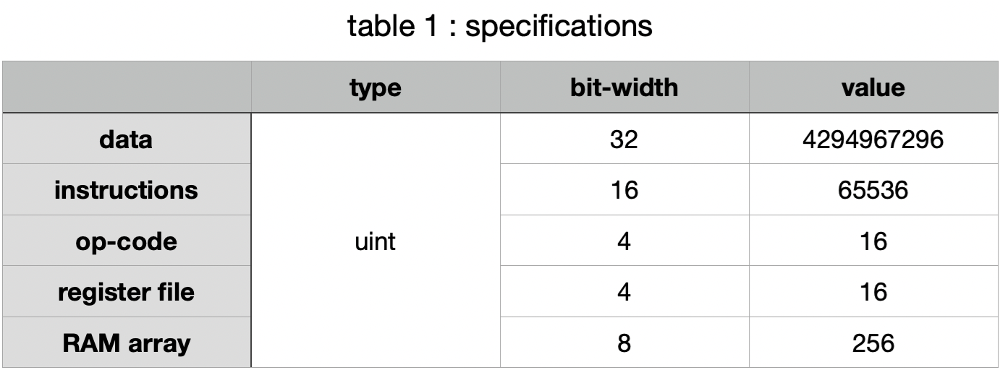
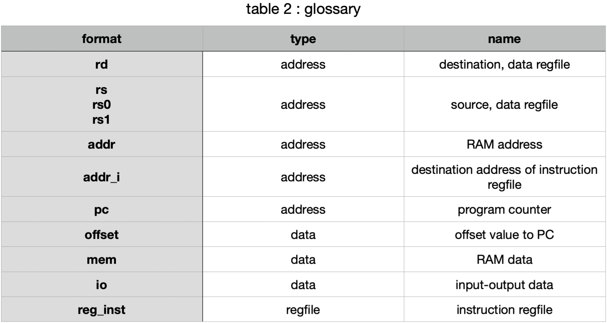
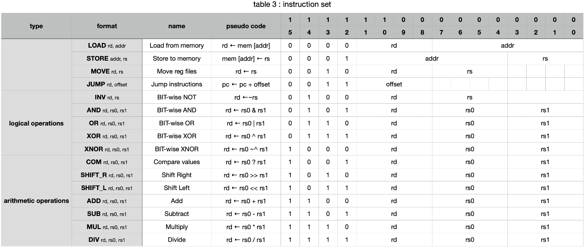
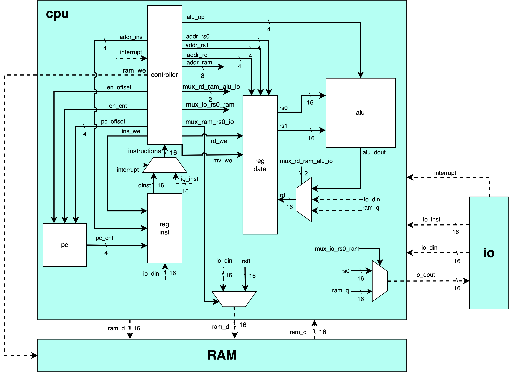

# cpu_v0

Simple CPU design inspired from RISC V (RV32I) instruction set

## Specifications
- 16 bit instructions
    - 4 bit opcode
    - 12 bit address/immediate
- 16 bit data
- regfile
    - data : 4 bit array
    - instrucitons : 4 bit array
- RAM
    - 8 bit array
    - data + instructions

## system diagram

